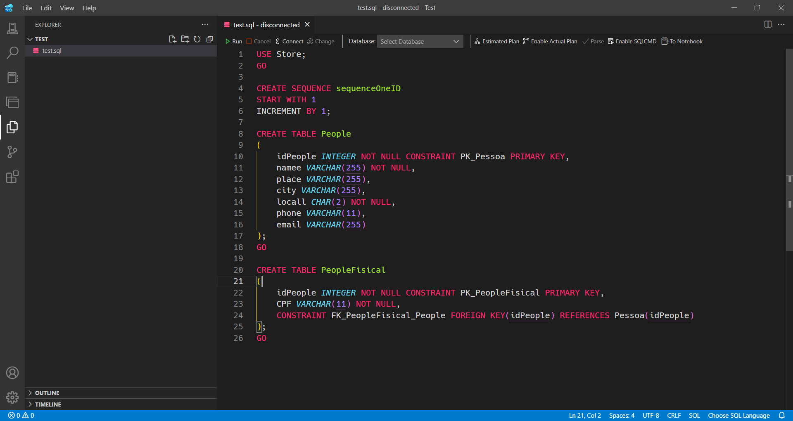
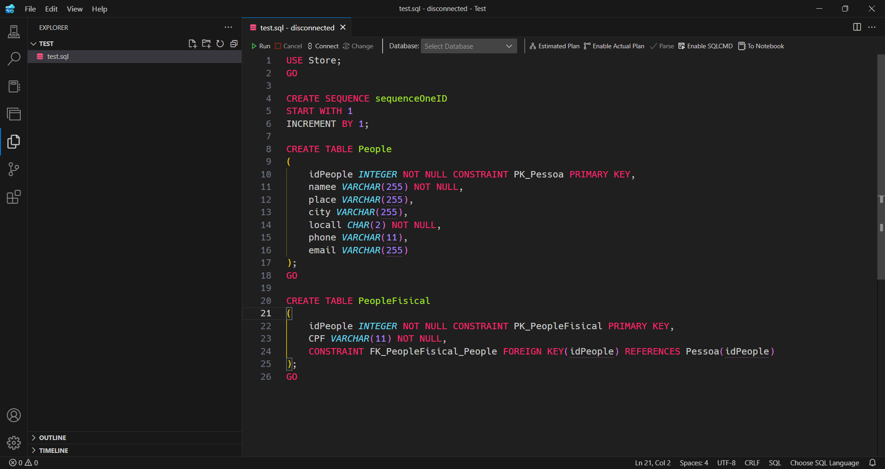

# Monokai DarkPlus for Azure Data Studio

A combination of the famous Monokai theme with the default VsCode Dark+ theme.

Simple theme, using Dark+ (default VSCode theme) for the window theme and Monokai for the editor theme.

You can install it by downloading the .vsix file and then with Azure Data Studio open, open the Command Prompt (Ctrl+Shift+P) and type `Extensions: Install from VSIX...`.
The color theme name is "Monokai for Azure".

Check the same theme but for [Visual Studio Code](https://github.com/filipeyay/monokai-darkplus-vscode).

## Based on

- The original Monokai Theme
- The original VsCode Theme
